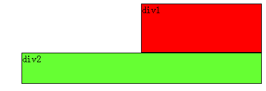

{{ page.title }}
================

30 Jun 2016 - HangZhou

##关于CSS浮动
-------------------

首先要知道，div是块级元素，在页面中独占一行，自上而下排列，也就是传说中的流。如下图：

可以看出，即使div1的宽度很小，页面中一行可以容下div1和div2，div2也不会排在div1后边，因为div元素是独占一行的。

注意，以上这些理论，是指标准流中的div。无论多么复杂的布局，其基本出发点均是：“如何在一行显示多个div元素”。

显然标准流已经无法满足需求，这就要用到浮动。 浮动可以理解为让某个div元素脱离标准流，漂浮在标准流之上，和标准流不是一个层次。

例如，假设上图中的div2浮动，那么它将脱离标准流，但div1、div3、div4仍然在标准流当中，所以div3会自动向上移动，占据div2的位置，重新组成一个流。如图：

从图中可以看出，由于对div2设置浮动，因此它不再属于标准流，div3自动上移顶替div2的位置，div1、div3、div4依次排列，成为一个新的流。又因为浮动是漂浮在标准流之上的，因此div2挡住了一部分div3，div3看起来变“矮”了。

这里div2用的是左浮动(float:left;)，可以理解为漂浮起来后靠左排列，右浮动(float:right;)当然就是靠右排列。这里的靠左、靠右是说页面的左、右边缘。

如果我们把div2采用右浮动，会是如下效果：

此时div2靠页面右边缘排列，不再遮挡div3，读者可以清晰的看到上面所讲的div1、div3、div4组成的流。

目前为止我们只浮动了一个div元素(div2)，如果浮动多个div呢？

下面我们把div2和div3都加上左浮动，效果如图：

同理，由于div2、div3浮动，它们不再属于标准流，因此div4会自动上移，与div1组成一个“新”标准流，而浮动是漂浮在标准流之上，因此div2又挡住了div4。

当同时对div2、div3设置浮动之后，div3会跟随在div2之后，不知道读者有没有发现，一直到现在，div2在每个例子中都是浮动的，但并没有跟随到div1之后。因此，我们可以得出一个重要结论：

假如某个div元素A是浮动的，如果A元素上一个元素也是浮动的，那么A元素会跟随在上一个元素的后边(如果一行放不下这两个元素，那么A元素会被挤到下一行)；如果A元素上一个元素是标准流中的元素，那么A的相对垂直位置不会改变，也就是说A的顶部总是和上一个元素的底部对齐。

为了帮助读者理解，再举几个例子。

假如我们把div2、div3、div4都设置成左浮动，效果如下：

根据上边的结论：先从div4开始分析，它发现上边的元素div3是浮动的，所以div4会跟随在div3之后；div3发现上边的元素div2也是浮动的，所以div3会跟随在div2之后；而div2发现上边的元素div1是标准流中的元素，因此div2的相对垂直位置不变，顶部仍然和div1元素的底部对齐。由于是左浮动，左边靠近页面边缘，所以左边是前，因此div2在最左边。

假如把div2、div3、div4都设置成右浮动，效果如下：

 

道理和左浮动基本一样，只不过需要注意一下前后对应关系。由于是右浮动，因此右边靠近页面边缘，所以右边是前，因此div2在最右边。

假如我们只把div2、div4左浮动，效果图如下：

依然是根据结论，div2、div4浮动，脱离了标准流，因此div3将会自动上移，与div1组成标准流。div2发现上一个元素div1是标准流中的元素，因此div2相对垂直位置不变，与div1底部对齐。div4发现上一个元素div3是标准流中的元素，因此div4的顶部和div3的底部对齐，并且总是成立的，因为从图中可以看出，div3上移后，div4也跟着上移，div4总是保证自己的顶部和上一个元素div3(标准流中的元素)的底部对齐。

至此，恭喜读者已经掌握了添加浮动，但还有清除浮动，有上边的基础清除浮动非常容易理解。

经过上边的学习，可以看出：元素浮动之前，也就是在标准流中，是竖向排列的，而浮动之后可以理解为横向排列。

清除浮动可以理解为打破横向排列。

清除浮动的关键字是clear，官方定义如下：

 <pre><code> 
       语法：
 
       clear : none | left | right | both
 
       取值：
 
       none  :  默认值。允许两边都可以有浮动对象
 
       left  :  不允许左边有浮动对象
 
       right :  不允许右边有浮动对象
 
       both  :  不允许有浮动对象
</code></pre>
复制代码
定义非常容易理解，但是读者实际使用时可能会发现不是这么回事。

定义没有错，只不过它描述的太模糊，让我们不知所措。

根据上边的基础，假如页面中只有两个元素div1、div2，它们都是左浮动，场景如下：

此时div1、div2都浮动，根据规则，div2会跟随在div1后边，但我们仍然希望div2能排列在div1下边，就像div1没有浮动，div2左浮动那样。

这时候就要用到清除浮动（clear），如果单纯根据官方定义，读者可能会尝试这样写：在div1的CSS样式中添加clear:right;，理解为不允许div1的右边有浮动元素，由于div2是浮动元素，因此会自动下移一行来满足规则。

其实这种理解是不正确的，这样做没有任何效果。

对于CSS的清除浮动(clear)，一定要牢记：这个规则只能影响使用清除的元素本身，不能影响其他元素。

怎么理解呢？就拿上边的例子来说，我们是想让div2移动，但我们却是在div1元素的CSS样式中使用了清除浮动，试图通过清除div1右边的浮动元素(clear:right;)来强迫div2下移，这是不可行的，因为这个清除浮动是在div1中调用的，它只能影响div1，不能影响div2。

要想让div2下移，就必须在div2的CSS样式中使用浮动。本例中div2的左边有浮动元素div1，因此只要在div2的CSS样式中使用clear:left;来指定div2元素左边不允许出现浮动元素，这样div2就被迫下移一行。

 那么假如页面中只有两个元素div1、div2，它们都是右浮动呢？读者此时应该已经能自己推测场景，如下：

 此时如果要让div2下移到div1下边，要如何做呢？

我们希望移动的是div2，就必须在div2的CSS样式中调用浮动，因为浮动只能影响调用它的元素。可以看出div2的右边有一个浮动元素div1，那么我们可以在div2的CSS样式中使用clear:right;来指定div2的右边不允许出现浮动元素，这样div2就被迫下移一行，排到div1下边。

